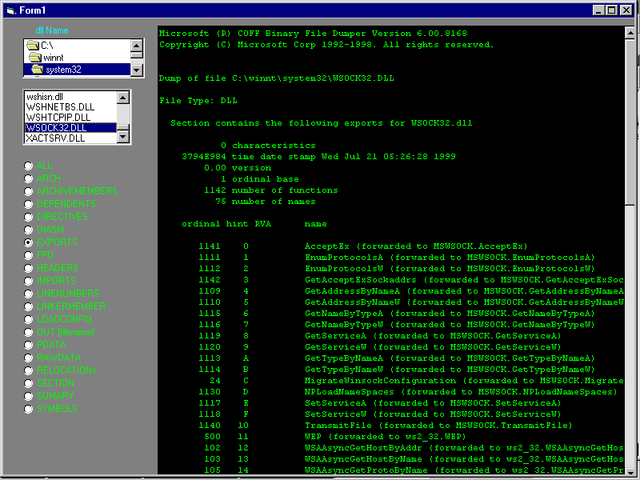

<div align="center">

## dll viewer


</div>

### Description

just a starter ... couldn't rely on MS APi viewer all the time.

This just peeks at any DLL. for various info.

This is just the interface . Actual work is done by dumpbin.exe(included)(if u do not like exes ..delete this and use ur own copy of dumpbin.Make sure ur path is correct).Program was to meet immediate requirements. More functionality comming . Lets call this ver 1.
 
### More Info
 
dll file

u might need to have access/rights enough to peeek dlls under windows/system?? . Though not necessary

lots of options


<span>             |<span>
---                |---
**Submitted On**   |2002-08-28 16:38:52
**By**             |[Pulsar180](https://github.com/Planet-Source-Code/PSCIndex/blob/master/ByAuthor/pulsar180.md)
**Level**          |Intermediate
**User Rating**    |4.3 (13 globes from 3 users)
**Compatibility**  |VB 6\.0
**Category**       |[Windows API Call/ Explanation](https://github.com/Planet-Source-Code/PSCIndex/blob/master/ByCategory/windows-api-call-explanation__1-39.md)
**World**          |[Visual Basic](https://github.com/Planet-Source-Code/PSCIndex/blob/master/ByWorld/visual-basic.md)
**Archive File**   |[dll\_viewer1239368292002\.zip](https://github.com/Planet-Source-Code/pulsar180-dll-viewer__1-38439/archive/master.zip)

### API Declarations

```
Private Type STARTUPINFO
   cb As Long
   lpReserved As String
   lpDesktop As String
   lpTitle As String
   dwX As Long
   dwY As Long
   dwXSize As Long
   dwYSize As Long
   dwXCountChars As Long
   dwYCountChars As Long
   dwFillAttribute As Long
   dwFlags As Long
   wShowWindow As Integer
   cbReserved2 As Integer
   lpReserved2 As Long
   hStdInput As Long
   hStdOutput As Long
   hStdError As Long
  End Type
  Private Type PROCESS_INFORMATION
   hProcess As Long
   hThread As Long
   dwProcessID As Long
   dwThreadID As Long
  End Type
  Private Declare Function WaitForSingleObject Lib "kernel32" (ByVal _
   hHandle As Long, ByVal dwMilliseconds As Long) As Long
  Private Declare Function CreateProcessA Lib "kernel32" (ByVal _
   lpApplicationName As String, ByVal lpCommandLine As String, ByVal _
   lpProcessAttributes As Long, ByVal lpThreadAttributes As Long, _
   ByVal bInheritHandles As Long, ByVal dwCreationFlags As Long, _
   ByVal lpEnvironment As Long, ByVal lpCurrentDirectory As String, _
   lpStartupInfo As STARTUPINFO, lpProcessInformation As _
   PROCESS_INFORMATION) As Long
  Private Declare Function CloseHandle Lib "kernel32" _
   (ByVal hObject As Long) As Long
  Private Declare Function GetExitCodeProcess Lib "kernel32" _
   (ByVal hProcess As Long, lpExitCode As Long) As Long
  Private Const NORMAL_PRIORITY_CLASS = &H20&
  Private Const INFINITE = -1&
```


